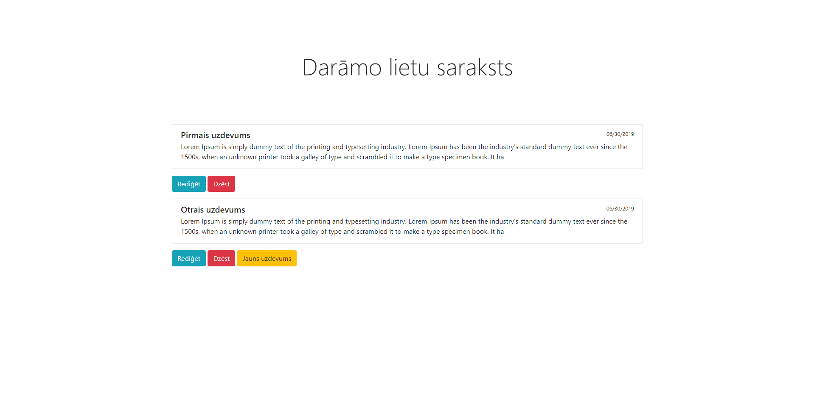
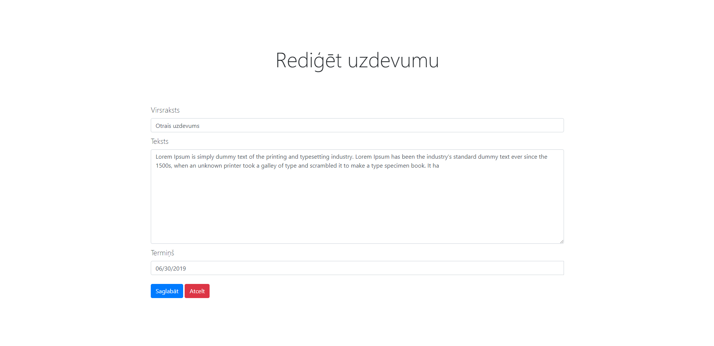
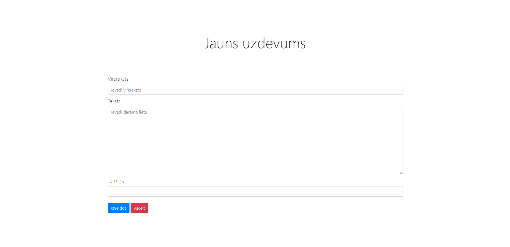

# To-do-List

Simple to do list where user manages their tasks.

## Prerequisites

* Git
* Local server ( Apache or XAMPP preferably )

## Setup

* Clone this repository in your server directory

* Start your local server

* Import posts.sql database in to your project

* Change the necessary parameters in config.php

## Pictures

## Author

* **Ričards Lazda** - [Ričards Lazda](https://github.com/ricardslazda)
